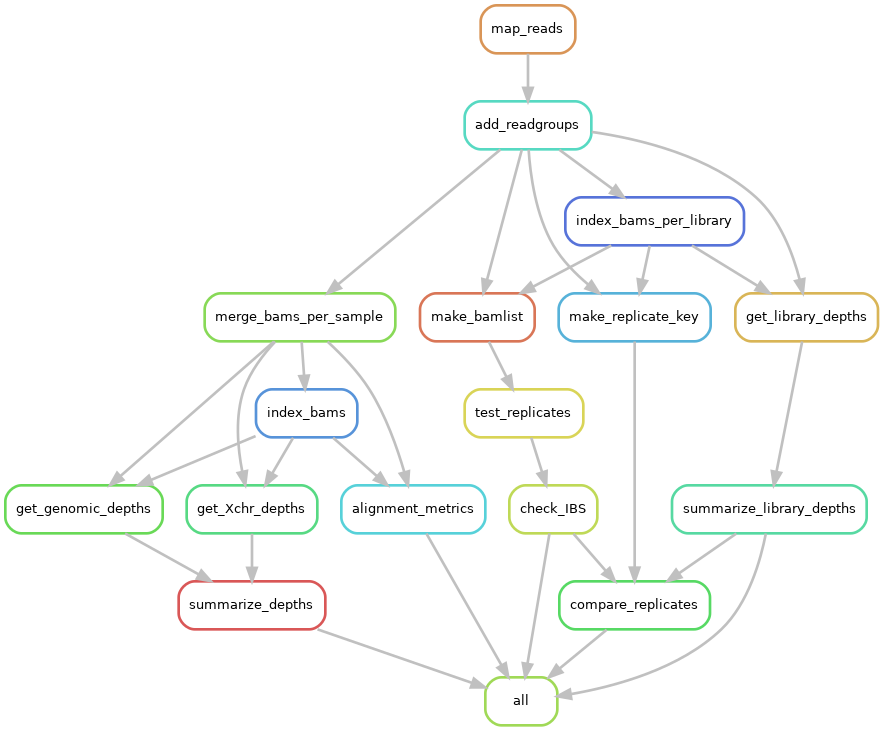

# 02. Alignment

## SNAKEFILE

This [**snakefile_alignPE**]() takes FASTQ files, aligns them to a reference genome, indexes the resulting bams, merges sequencing replicates, and generates resulting read depth information for each sample. It simultaneously runs an IBS (Identity-by-State) analysis on the replicates to ensure that only true replicates are being merged and also to identify possible replicate individuals that were mislabeled as separate individuals (i.e. a recaptured individual that was considered new and given a new field ID).  

You shouldn’t need to modify anything in the snakefile unless you want to tweak parameters that are not explicitly set in the config file already! If you want to run the alignment pipline as is, just modify the [**snakefile_alignPE.yml**]() config file with the appropriate files paths.

 


## REQUIRED ACCESSORY FILES

Part of this pipeline also relies on an accessory R script -> [**compare_replicates.R**]() \
You'll want to make sure you download that as well and keep it in the same directory as your snakemake and .yml files.

## OTHER NECESSARY INPUT FILES
* In order to run this pipeline all you need is the file called [**samples.txt**]() which has no headers and 2 columns. The first column has the sample ID associated with the fastqfile. The second column has the library ID associated with the fastq file. Note that these might be the same if you don’t have any replicates in your data, but if a single sample (individual) had multiple sequencing replcates there may be several unique library IDs with the same sample ID. Ultimately this pipeline will merge those into a single output bam file. Additionally, if you have a weird file naming convention in your fastq files and want to modify it in the .bam files this is a good place to do that.

* Note that Snakemake will make any listed directories for you so no need to do that head of time.

Once you have all the necessary files and have modified the filepaths (and any settings you want to change) in the [**snakefile_alignPE.yml**]() config file. You can run the pipeline with the following commands

If you haven't already created a conda environment and configured your slurm profile see [**00.Conda-Snakemake-Slurm**](/00.Conda-Snakemake-Slurm)
```
# I like to run this using screen
screen -S GBSworkflow

# Load the conda environment
micromamba activate GBS

# This will do a quick dry run of your pipeline.
snakemake -s snakefile_alignPE --profile slurm -n -r

# If everything looks good (lots of green and yellow printout — no red) you can execute the pipeline. Here you can see I set the number of jobs to 20, overriding the default 100 that is in my slurm profile because the alignment can be pretty computationally intensive and I don’t want to eat up too many resources on farm at once.
snakemake -s snakefile_alignPE --profile slurm -j 20
```
