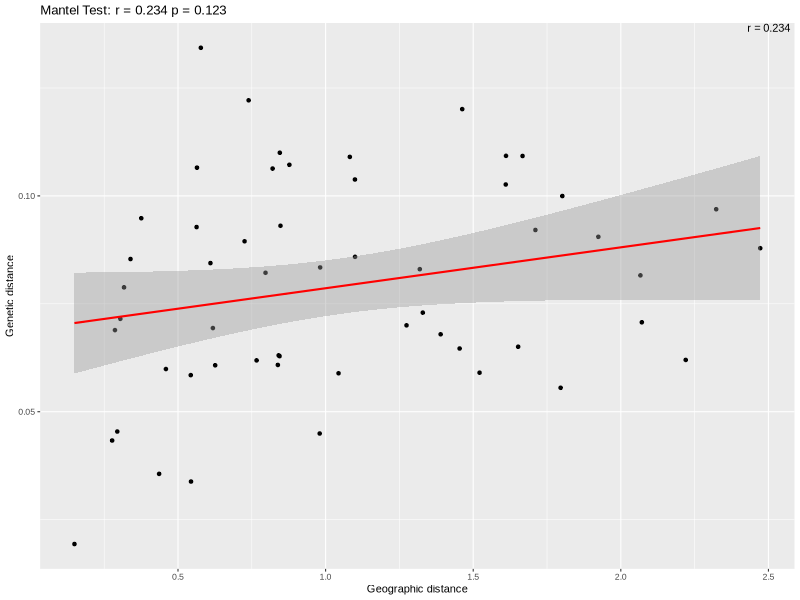
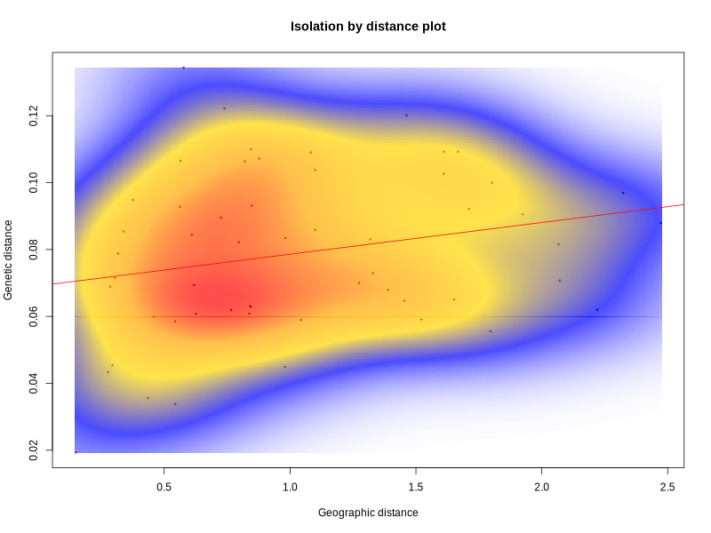

There are several different ways to calculate genetic distance. 
* You can do it between individuals or groups of individuals (subpopulations).
* There are also several different metrics and the one you choose to calculate will depend on the downstream analyses you plan to run.


## Calculate Pairwise Fst and Nei's D
```
# Install and load required packages
install.packages("adegenet")
install.packages("vcfR")
install.packages("hierfstat")
install.packages("StAMPP")
library(adegenet)
library(vcfR)
library(hierfstat)
library(StAMPP)

# Set working directory to the directory containing your files
# setwd("/path/to/your/directory")

# List all files in the directory to verify the presence of populations_info.txt
print(list.files())

# Read the population information file
pop_data <- read.table("population_info.txt", header = TRUE)
print(pop_data)

# Read the VCF file
vcf <- read.vcfR("populations.snps.vcf")

# Convert VCF to genlight object
genlight_obj <- vcfR2genlight(vcf)

# Debugging step: check the sample IDs in the genlight object
print(indNames(genlight_obj))

# Ensure the sample IDs in pop_data match those in genlight_obj
if (!all(pop_data$IndividualID %in% indNames(genlight_obj))) {
  stop("Some sample IDs in populations_info.txt do not match those in the VCF file.")
} else {
  message("All sample IDs in populations_info.txt match those in the VCF file.")
}

# Assign population information to genlight object
pop(genlight_obj) <- pop_data$Population[match(indNames(genlight_obj), pop_data$IndividualID)]

# Verify the populations have been correctly assigned
print(pop(genlight_obj))

# Convert genlight object to StAMPP format
stampp_data <- stamppConvert(genlight_obj, "genlight")

# Calculate pairwise Fst
stampp_fst <- stamppFst(stampp_data, nboots = 100, percent = 95, nclusters = 1)

# Extract the Fst matrix
fst_matrix <- stampp_fst$Fsts

# Print the Fst matrix
print(fst_matrix)

# Save the Fst matrix to a CSV file
write.csv(fst_matrix, "pairwise_fst_matrix.csv", row.names = TRUE)

# Calculate Nei's genetic distance (D)
neis_d_matrix <- stamppNeisD(stampp_data)

# Print Nei's D matrix
print(neis_d_matrix)

# Save Nei's D matrix to a CSV file
write.csv(as.matrix(neis_d_matrix), "neis_d_matrix.csv", row.names = TRUE)
```

## Testing Isolation by Distance
Read in the initial vcf file as a genind object
```
genind_obj <- vcfR2genind(vcf)
```
Assign population information to genind object
```
pop(genind_obj) <- pop_data$Population[match(indNames(genind_obj), pop_data$IndividualID)]
```
Convert genind object to a genpop object
```
genpop_obj <- genind2genpop(genind_obj)
```
Read the geographic information file for subpopulation centroids
Ensure the file contains columns: Population, Latitude, Longitude
```
geo_centroids <- read.table("subpopulation_centroids.txt", header = TRUE)
```
Ensure the subpopulation IDs in geo_centroids match those in genpop_obj
```
genpop_populations <- row.names(tab(genpop_obj))

if (!all(genpop_populations %in% geo_centroids$Population)) {
  stop("Some population IDs in subpopulation_centroids.txt do not match those in the genpop object.")
} else {
  message("All population IDs in subpopulation_centroids.txt match those in the genpop object.")
}
```
Assign latitude and longitude information to a matrix
```
latlong <- geo_centroids[match(genpop_populations, geo_centroids$Population), c("Latitude", "Longitude")]
rownames(latlong) <- genpop_populations
```
Calculate pairwise genetic distances and pairwise geographic distances
```
Dgen <- dist.genpop(genpop_obj)
Dgeo <- dist(latlong)
```
Run a mantel test
```
ibd_result <- mantel.randtest(Dgen, Dgeo)
ibd_result
Monte-Carlo test
Call: mantel.randtest(m1 = Dgen, m2 = Dgeo)

Observation: 0.2344444 

Based on 999 replicates
Simulated p-value: 0.123 
Alternative hypothesis: greater 

    Std.Obs Expectation    Variance 
1.244414179 0.003872999 0.034330559 
```
The above indicates there is no strong evidence to support Isolation by Distance in this system.

## Plot the data
Convert dist objects to matrices
```
geo_matrix <- as.matrix(Dgeo)
gen_matrix <- as.matrix(Dgen)
```
Extract the lower (or upper) triangle of the matrix as vectors
```
geo_vector <- geo_matrix[lower.tri(geo_matrix)]
gen_vector <- gen_matrix[lower.tri(gen_matrix)]
```
Calculate the r_value
```
r_value <- cor(geo_vector, gen_vector)
r_value
```
Fit a linear model
```
model <- lm(gen_vector ~ geo_vector)
```
Plot geographic vs. genetic distances with the linear model
```
# Save the plot to a PNG file with trend line and Mantel test statistic
png("KF_Optimized_Resistance_Distance_Null_Model_20240628.png", width = 800, height = 600)

# Create the plot using ggplot2
plot_data <- data.frame(GeographicDistance = geo_vector, GeneticDistance = gen_vector)
ggplot(plot_data, aes(x = GeographicDistance, y = GeneticDistance)) +
  geom_point() +
  geom_smooth(method = "lm", col = "red") +
  labs(title = paste("Mantel Test: r =", round(ibd_result$obs, 3), "p =", round(ibd_result$pvalue, 3)),
       x = "Geographic distance", y = "Genetic distance") +
  annotate("text", x = Inf, y = Inf, label = paste("r =", round(r_value, 3)), hjust = 1.1, vjust = 1.1)

dev.off()
```
<div align="center">
  
</div>

You can also visualize this with a kernel density plot
```
png("KF_Optimized_Resistance_Distance_Null_Model_20240628_kde.png", width = 800, height = 600)
dens <- kde2d(geo_vector, gen_vector, n = 300)
myPal <- colorRampPalette(c("white", "blue", "gold", "orange", "red"))
plot(geo_vector, gen_vector, pch = 20, cex = 0.5, xlab = "Geographic distance", ylab = "Genetic distance")
image(dens, col = transp(myPal(300), 0.7), add = TRUE)
abline(model, col = "red")
title("Isolation by distance plot")
dev.off()
```
<div align="center">
  
</div>

