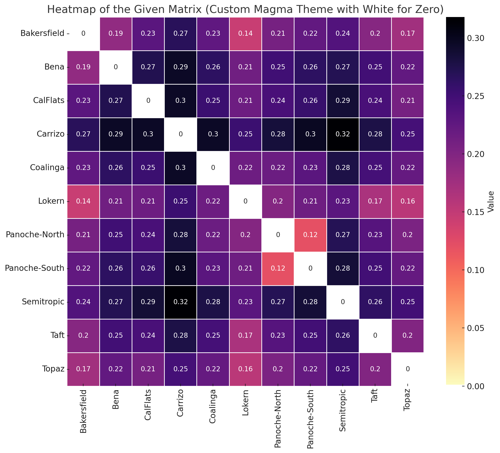
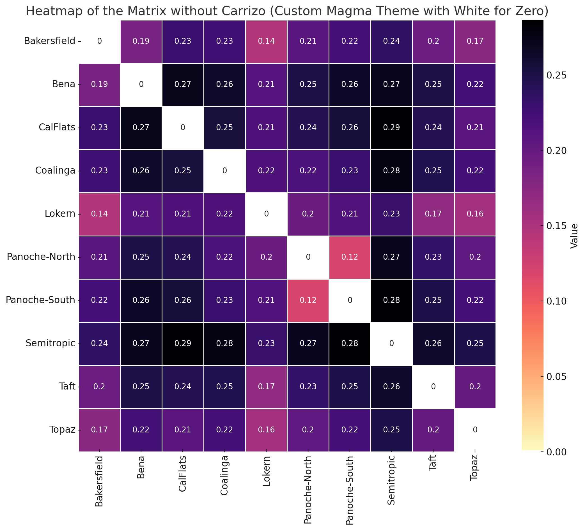

Some comments on generating raster layers. I initially did this in QGIS but was running into some really weird issues where converting linear features (roads) to raster cells was resulting in gaps in my raster layer that seemed like they would cause problems for modeling resistance and current.... I ended up using 'gdal' and it worked great and was pretty straightforward. See [RasterizingData.md](https://github.com/squisquater/KitFoxGBS/blob/main/LandGenR/Radish/RasterizingData.md) for notes on how to ensure all raster layers are the same resolution and extent.

## GENERATE A CHORD (DISTANCE) MATRIX
I can't find a good tool for data conversion so I'm tweaking the format the plink file myself.
Note: For some weird reason I have logical values (TRUE only) in my plink file. I converted all of these to "T".
```
library(adegenet)

# Load the necessary data if not already loaded - make sure if this is coming from stacks there is no header
plink.ped <- read.table("/group/ctbrowngrp2/sophiepq/KitFoxGBS/stacks/SJKF_metapop_LandGen_n223_20x/populations.plink_noheader.ped", header=FALSE, stringsAsFactors = FALSE)
plink.map <- read.table("/group/ctbrowngrp2/sophiepq/KitFoxGBS/stacks/SJKF_metapop_LandGen_n223_20x/populations.plink_noheader.map", header=FALSE, stringsAsFactors = FALSE)

# Extract FamilyID, IndividualID, and SNP columns
individual_info <- plink.ped[, 1:2]
num_snps <- (ncol(plink.ped) - 6) / 2
snp_data <- plink.ped[, 7:ncol(plink.ped)]

# Convert logical columns to character to ensure no logical values
snp_data <- apply(snp_data, 2, function(col) {
  if (is.logical(col)) {
    col <- as.character(col)
  }
  return(col)
})

# Replace "TRUE" with "T" in the snp_data
snp_data[snp_data == "TRUE"] <- "T"

# Check for any logical values in the cleaned snp_data
logical_values_after <- unique(as.vector(snp_data[sapply(snp_data, is.logical)]))
if (length(logical_values_after) > 0) {
  print("Logical values found in snp_data after cleaning:")
  print(logical_values_after)
} else {
  print("No logical values found in snp_data after cleaning.")
}

# Check unique values in snp_data before merging to identify problematic entries
unique_snp_values_before <- unique(as.vector(snp_data))
print("Unique values in snp_data before merging:")
print(unique_snp_values_before)

# Function to merge SNP alleles into a single genotype and convert "00" to NA
merge_snps <- function(df) {
  merged_snps <- apply(df, 1, function(row) {
    snps <- as.character(row[seq(1, length(row), by=2)])
    alleles <- as.character(row[seq(2, length(row), by=2)])
    genotypes <- paste(snps, alleles, sep="")
    genotypes[genotypes == "00"] <- NA
    return(genotypes)
  })
  return(t(merged_snps))
}

# Merge the SNP columns
merged_snps <- merge_snps(snp_data)

# Check unique values in merged_snps to verify format
unique_values <- unique(as.vector(merged_snps))
print("Unique values in merged_snps:")
print(unique_values)

# Assign column names to merged SNPs using SNP IDs from .map file
snp_ids <- plink.map$V2
colnames(merged_snps) <- snp_ids

# Combine the individual info with merged SNP data
final_data <- cbind(individual_info, merged_snps)

# Print a subset of final_data to check the combined data format
print(head(final_data, 10))  # Print a larger sample of rows

# Import the data frame into a genind object
data.genind <- adegenet::df2genind(X=final_data[,-c(1:2)], sep="", ncode=1,   
                          ind.names=final_data$V2, loc.names=NULL, 
                          pop=final_data$V1, NA.char="NA", ploidy=2, 
                          type="codom", strata=NULL, hierarchy=NULL)
data.genind

genpop_obj <- genind2genpop(data.genind)

genpop_obj

chord_dist <- dist.genpop(genpop_obj, method = 2, diag = TRUE, upper = TRUE)

# convert to matrix
chord_dist_matrix <- as.matrix(chord_dist)

# write to an external file for future use.
write.table(chord_dist_matrix, file = "KF_chord_dist_matrix.txt", sep = "\t", row.names = TRUE, quote = FALSE)
```
<div align="center">
  
</div>

I also have a dataset that doesn't include Carrizo
<div align="center">
  
</div>


## Run Radish
```
library(radish)
library(raster)

# If you are starting from this point and need to load your distance matrix you can do so with the following line of code.
# Read the file into a data frame
chord_dist_df <- read.table("KF_chord_dist_matrix.txt", sep = "\t", header = TRUE, row.names = 1)

# Also trying a matrix that does not include Carrizo because it seems like it might just be a strong signal due to small sample size.
#chord_dist_df <- read.table("KF_chord_dist_matrix_noCarrizo.txt", sep = "\t", header = TRUE, row.names = 1)

# Convert the data frame to a matrix
chord_dist_matrix <- as.matrix(chord_dist_df)

# Run Radish
myRaster <- raster("/group/ctbrowngrp2/sophiepq/KitFoxGBS/LandGenR/Radish/KitFox-ESARPmodel-Raster1000x1000-FillAllCells.tif")


# Testing out different road rasters
#roadRaster <- raster("/group/ctbrowngrp2/sophiepq/KitFoxGBS/LandGenR/Radish/CaliforniaRoads-Reprojected-1000x1000-FillAllCells.tif")
#roadRaster <- raster("/group/ctbrowngrp2/sophiepq/KitFoxGBS/LandGenR/Radish/CaliforniaRoads-Reprojected-1000x1000-MajorRoadsOnly.tif")
#roadRaster <- raster("/group/ctbrowngrp2/sophiepq/KitFoxGBS/LandGenR/CaliforniaMajorRoads_rasterized.tif")
roadRaster <- raster("/group/ctbrowngrp2/sophiepq/KitFoxGBS/LandGenR/CaliforniaMajorHighways_rasterized.tif")


# scaling spatial covariates helps avoid numeric overflow
covariates <- raster::stack(list(kfsuit = raster::scale(myRaster),
                                roads = raster::scale(roadRaster)))
                                

#Load in spatial points dataframe
#df <- data.frame(lon = c(-119.063, -118.769, -120.301, -119.836, -120.263, -119.607, -120.878, -120.749, -119.579, -119.462, -120.043), lat = c(35.366, 35.354, 35.85, 35.174, 36.187, 35.375, 36.644, 36.569, 35.691, 35.139, 35.372))

#Alt SPDF that doesn't have carrizo!
df <- data.frame(lon = c(-119.063, -118.769, -120.301, -120.263, -119.607, -120.878, -120.749, -119.579, -119.462, -120.043), lat = c(35.366, 35.354, 35.85, 36.187, 35.375, 36.644, 36.569, 35.691, 35.139, 35.372))

#Convert to spatial points dataframe
coordinates(df) <- ~ lon + lat
proj4string(df) <- CRS("+proj=longlat +datum=WGS84 +no_defs")

# Extract the CRS from the existing raster
raster_crs <- crs(covariates)

# Reproject the spatial points to match the raster CRS
df_projected <- spTransform(df, CRSobj = raster_crs)

#Extract to a spatial points object
df_points <- SpatialPoints(coordinates(df_projected), proj4string = CRS(proj4string(df_projected)))

png("KFsuit.png", width = 800, height = 600)
plot(covariates[["kfsuit"]])
points(df_points, pch = 19)
dev.off()

png("Majorroads.png", width = 800, height = 600)
plot(covariates[["roads"]])
points(df_points, pch = 19)
dev.off()

surface <- conductance_surface(covariates, df_points, directions = 8)
```
Note that radish has different models that you can implement for estimating conductance surfaces. You can use the least squares model or the MLPE (Maximum Likelihood Population Effects) model but they differ in their approaches and assumptions.
* The least squares model is simpler and faster and can work well if your data is fairly straightforward (i.e. where the relationship between the predictors and the response is approximately linear)
but the MPLE model i
* Otherwise I recommend the MLPE model which is more computationally intensive but better equiped to handle complex relaionships in your data.


**This is modeling kit fox habitat suitability with the new highway layer I made in 'gdal'**
```
fit_mlpe_full <- radish(chord_dist_matrix ~ kfsuit + roads, surface, 
                   radish::loglinear_conductance, radish::mlpe)

summary(fit_mlpe_full)
> summary(fit_mlpe_full)
Conductance surface with 146970 vertices (11 focal) estimated by maximum likelihood
Call:   radish(formula = chord_dist_matrix ~ kfsuit + roads, data = surface, 
    conductance_model = radish::loglinear_conductance, measurement_model = radish::mlpe)

Loglikelihood: 201.0076 (6 degrees freedom)
AIC: -390.0151 

Number of function calls: 28 
Number of Newton-Raphson steps: 7 
Norm of gradient at MLE: 3.895811e-06 

Nuisance parameters:
 alpha    beta     tau     rho  
0.1531  0.8375  5.9776  3.2640  

Coefficients:
       Estimate Std. Error z value Pr(>|z|)   
kfsuit   0.9329     0.3141   2.970  0.00298 **
roads   -0.1580     0.8868  -0.178  0.85860   
---
Signif. codes:  0 ‘***’ 0.001 ‘**’ 0.01 ‘*’ 0.05 ‘.’ 0.1 ‘ ’ 1

Correlation of Coefficients:
         kfsuit
roads 0.2499018

```
**This is a reduced model that tests kit fox habitat suitability on it's own**
```
fit_mlpe_kfsuit <- radish(chord_dist_matrix ~ kfsuit, surface, 
                   radish::loglinear_conductance, radish::mlpe)

summary(fit_mlpe_kfsuit)

> summary(fit_mlpe_kfsuit)
Conductance surface with 146970 vertices (11 focal) estimated by maximum likelihood
Call:   radish(formula = chord_dist_matrix ~ kfsuit, data = surface, 
    conductance_model = radish::loglinear_conductance, measurement_model = radish::mlpe)

Loglikelihood: 200.9751 (5 degrees freedom)
AIC: -391.9503 

Number of function calls: 18 
Number of Newton-Raphson steps: 5 
Norm of gradient at MLE: 2.643463e-11 

Nuisance parameters:
 alpha    beta     tau     rho  
0.1533  0.8422  5.9679  3.2751  

Coefficients:
       Estimate Std. Error z value Pr(>|z|)   
kfsuit   0.9468     0.3016   3.139  0.00169 **
---
Signif. codes:  0 ‘***’ 0.001 ‘**’ 0.01 ‘*’ 0.05 ‘.’ 0.1 ‘ ’ 1
```
**This model tests an for an interaction between kit fox habitat suitability and roads**
```
fit_mlpe_int <- radish(chord_dist_matrix ~ kfsuit*roads, surface, 
                   radish::loglinear_conductance, radish::mlpe)
summary(fit_mlpe_int)

> summary(fit_mlpe_int)
Conductance surface with 146970 vertices (11 focal) estimated by maximum likelihood
Call:   radish(formula = chord_dist_matrix ~ kfsuit * roads, data = surface, 
    conductance_model = radish::loglinear_conductance, measurement_model = radish::mlpe)

Loglikelihood: 201.014 (7 degrees freedom)
AIC: -388.0281 

Number of function calls: 30 
Number of Newton-Raphson steps: 8 
Norm of gradient at MLE: 7.582142e-10 

Nuisance parameters:
 alpha    beta     tau     rho  
0.1532  0.8321  5.9742  3.2687  

Coefficients:
             Estimate Std. Error z value Pr(>|z|)  
kfsuit        0.91849    0.38168   2.406   0.0161 *
roads        -0.04824    0.84446  -0.057   0.9544  
kfsuit:roads -0.15871    1.67999  -0.094   0.9247  
---
Signif. codes:  0 ‘***’ 0.001 ‘**’ 0.01 ‘*’ 0.05 ‘.’ 0.1 ‘ ’ 1

Correlation of Coefficients:
                kfsuit     roads
roads        0.3706587          
kfsuit:roads 0.5580897 0.2097804

```
**This model tests against the null model of IBD**
```
fit_mlpe_ibd <- radish(chord_dist_matrix ~ 1, surface, 
                   radish::loglinear_conductance, radish::mlpe)
summary(fit_mlpe_ibd)

> summary(fit_mlpe_ibd)
Conductance surface with 146970 vertices (11 focal) estimated by maximum likelihood
Call:   radish(formula = chord_dist_matrix ~ 1, data = surface, conductance_model = radish::loglinear_conductance, 
    measurement_model = radish::mlpe)

Loglikelihood: 199.4003 (4 degrees freedom)
AIC: -390.8006 

Number of function calls: 1 
Number of Newton-Raphson steps: 0 
Norm of gradient at MLE: NA 

Nuisance parameters:
  alpha     beta      tau      rho  
0.09438  0.38979  6.39472  2.63130  

No coefficients

```
**Compare models**
```
## Null vs Full model
anova(fit_mlpe_ibd, fit_mlpe_full)
Likelihood ratio test
Null: ~ 1
Alt: ~ kfsuit + roads
     logLik Df  ChiSq Df(ChiSq) Pr(>Chi)
Null 199.40  4                          
Alt  201.01  6 3.2145         2   0.2004

## Null vs Reduced model (suitability only)
> anova(fit_mlpe_ibd, fit_mlpe_kfsuit)
Likelihood ratio test
Null: ~ 1
Alt: ~ kfsuit
     logLik Df  ChiSq Df(ChiSq) Pr(>Chi)  
Null 199.40  4                            
Alt  200.97  5 3.1497         1  0.07594 .
---
Signif. codes:  0 ‘***’ 0.001 ‘**’ 0.01 ‘*’ 0.05 ‘.’ 0.1 ‘ ’ 1


## Null vs Interaction model
anova(fit_mlpe_ibd, fit_mlpe_int)
Likelihood ratio test
Null: ~ 1
Alt: ~ kfsuit + roads + kfsuit:roads
     logLik Df  ChiSq Df(ChiSq) Pr(>Chi)
Null 199.40  4                          
Alt  201.01  7 3.2275         3   0.3579
```

## Visualizing Results
Let's look at the relationship between the genetic distance (chord distance) and the optimized resistance distance from our top MLPE model. These look awful!
```
png("KF Optimized Resistance Distance - KFSuit Model - 20240628.png", width = 800, height = 600)
plot(fitted(fit_mlpe_kfsuit, "distance"), chord_dist_matrix, pch = 19,
     xlab = "Optimized resistance distance", ylab = "chord distance")
dev.off()

png("KF Optimized Resistance Distance - Full Model - 20240628.png", width = 800, height = 600)
plot(fitted(fit_mlpe_full, "distance"), chord_dist_matrix, pch = 19,
     xlab = "Optimized resistance distance", ylab = "chord distance")
dev.off()

```
## Plot fitted conductance surface
```
fitted_conductance <- conductance(surface, fit_mlpe, quantile = 0.95)

png("KF Fitted Conductance - Full Model No Carrizo - 20240628.png", width = 800, height = 600)
plot(log(fitted_conductance[["est"]]), 
     main = "Fitted conductance surface\n(kfsuit + roads)")
dev.off()
```

############### OLD IGNORE FOR NOW !!! ####################

Let's see what it looks like if we move through the rest of the process of plotting the conductance surface.
```
# visualisation:
png("KF Optimized Resistance Distance - KFSuit Model - 20240628.png", width = 800, height = 600)
plot(fitted(fit_nnls, "distance"), chord_dist_matrix, pch = 19,
     xlab = "Optimized resistance distance", ylab = "chord distance")
dev.off()

# visualise estimated conductance surface
fitted_conductance <- conductance(surface, fit_nnls, quantile = 0.95)

png("KF FittedConductance KFSuit Model - 20240628.png", width = 800, height = 600)
plot(fitted_conductance[["est"]], 
     main = "Fitted conductance surface\n(KFSuit)")
points(df_points, pch = 19)
dev.off()

png("KF FittedConductance Lower95 - KFSuit Model - 20240628.png", width = 800, height = 600)
plot(fitted_conductance[["lower95"]], 
     main = "Fitted conductance surface\n(KFSuit)")
points(df_points, pch = 19)
dev.off()

png("KF FittedConductance Upper95 - KFSuit Model - 20240628.png", width = 800, height = 600)
plot(fitted_conductance[["upper95"]], main = 
     "Fitted conductance surface\n(KFSuit)")
points(df_points, pch = 19)
dev.off()
```
Trying other model combos - Can I recreate the full model I made a few weeks go...?

```
################# ALT MODELS #######################


### This is the model summary for just the major roads alone (no kf suit or minor roads)
> summary(fit_mlpe)
Conductance surface with 146970 vertices (11 focal) estimated by maximum likelihood
Call:   radish(formula = chord_dist_matrix ~ roads, data = surface, conductance_model = radish::loglinear_conductance, 
    measurement_model = radish::mlpe)

Loglikelihood: 199.5061 (5 degrees freedom)
AIC: -389.0122 

Number of function calls: 5 
Number of Newton-Raphson steps: 2 
Norm of gradient at MLE: 3.680808e-11 

Nuisance parameters:
  alpha     beta      tau      rho  
0.09507  0.62003  6.39888  2.63087  

Coefficients:
      Estimate Std. Error z value Pr(>|z|)
roads   -4.622        NaN     NaN      NaN
Warning messages:
1: In sqrt(diag(solve(x$fit$hessian))) : NaNs produced
2: In summary.radish(fit_mlpe) :
  Hessian matrix has negative eigenvalues: possibly a saddle point
3: In sqrt(1/diag(V)) : NaNs produced
4: In cov2cor(vcov) :
  diag(.) had 0 or NA entries; non-finite result is doubtful

### This is the model summary for the kfsuit and Major roads (no minor roads)###
> summary(fit_mlpe)
Conductance surface with 146970 vertices (11 focal) estimated by maximum likelihood
Call:   radish(formula = chord_dist_matrix ~ kfsuit + roads, data = surface, 
    conductance_model = radish::loglinear_conductance, measurement_model = radish::mlpe)

Loglikelihood: 201.0082 (6 degrees freedom)
AIC: -390.0164 

Number of function calls: 25 
Number of Newton-Raphson steps: 7 
Norm of gradient at MLE: 1.417013e-08 

Nuisance parameters:
 alpha    beta     tau     rho  
0.1531  0.8361  5.9783  3.2631  

Coefficients:
       Estimate Std. Error z value Pr(>|z|)   
kfsuit   0.9316     0.3159   2.949  0.00318 **
roads   -0.1823     1.2182  -0.150  0.88102   
---
Signif. codes:  0 ‘***’ 0.001 ‘**’ 0.01 ‘*’ 0.05 ‘.’ 0.1 ‘ ’ 1

Correlation of Coefficients:
         kfsuit
roads 0.2689689

### This is the model summary for the kfsuit and roads (Major + Minor) combined ###
> summary(fit_mlpe)
Conductance surface with 146970 vertices (11 focal) estimated by maximum likelihood
Call:   radish(formula = chord_dist_matrix ~ kfsuit + roads, data = surface, 
    conductance_model = radish::loglinear_conductance, measurement_model = radish::mlpe)

Loglikelihood: 203.0221 (6 degrees freedom)
AIC: -394.0442 

Number of function calls: 33 
Number of Newton-Raphson steps: 9 
Norm of gradient at MLE: 2.579128e-10 

Nuisance parameters:
  alpha     beta      tau      rho  
0.08522  0.64523  6.58993  2.54468  

Coefficients:
       Estimate Std. Error z value Pr(>|z|)    
kfsuit   0.2086     0.2817   0.741    0.459    
roads    0.7371     0.1307   5.639 1.71e-08 ***
---
Signif. codes:  0 ‘***’ 0.001 ‘**’ 0.01 ‘*’ 0.05 ‘.’ 0.1 ‘ ’ 1

Correlation of Coefficients:
         kfsuit
roads 0.3542544

# visualisation:
png("KF Optimized Resistance Distance MajorRoads + KFSuit Model.png", width = 800, height = 600)
plot(fitted(fit_mlpe, "distance"), chord_dist_matrix, pch = 19,
     xlab = "Optimized resistance distance", ylab = "chord distance")
dev.off()

# visualise estimated conductance surface and asymptotic confidence intervals
fitted_conductance <- conductance(surface, fit_mlpe, quantile = 0.95)

png("KF FittedConductance  MajorRoads + KFSuit Model.png", width = 800, height = 600)
plot(fitted_conductance[["est"]], 
     main = "Fitted conductance surface\n(MajorRoads + KFSuit)")
points(df_points, pch = 19)
dev.off()

png("KF FittedConductance Lower95 MajorRoads Model.png", width = 800, height = 600)
plot(fitted_conductance[["lower95"]], 
     main = "Fitted conductance surface\n(roads)")
points(df_points, pch = 19)
dev.off()

png("KF FittedConductance Upper95 MajorRoads Model.png", width = 800, height = 600)
plot(fitted_conductance[["upper95"]], main = 
     "Fitted conductance surface\n(roads)")
points(df_points, pch = 19)
dev.off()

# visualise likelihood surface across grid (takes awhile)
theta <- as.matrix(expand.grid(kfsuit=seq(-1,1,length.out=21)))
grid <- radish_grid(theta, chord_dist_matrix ~ kfsuit + roads, surface,
                    radish::loglinear_conductance, radish::mlpe)

library(ggplot2)
png("KF LikelihoodSurface.png", width = 800, height = 600)
ggplot(data.frame(loglik=grid$loglik, grid$theta), 
       aes(x=kfsuit, y=kfsuit)) + 
  geom_tile(aes(fill=loglik)) + 
  geom_contour(aes(z=loglik), color="black") +
  annotate(geom = "point", colour = "red",
           x = coef(fit_mlpe)["kfsuit"], 
           y = coef(fit_mlpe)["kfsuit"]) +
  theme_bw() +
  xlab(expression(theta[kfsuit])) +
  ylab(expression(theta[kfsuit]))
dev.off()

# calculate resistance distances across grid
distances <- radish_distance(theta, ~ kfsuit + roads, 
                             surface, radish::loglinear_conductance)

#ibd <- which(theta[,1] == 0 & theta[,2] == 0) ## this would be if I had two layers
ibd <- which(theta[,1] == 0)

png("KF Null Resistance Distance.png", width = 800, height = 600)
plot(distances$distance[,,ibd], chord_dist_matrix, pch = 19, 
     xlab = "Null resistance distance (IBD)", ylab = "Chord Distance")
dev.off()

#### Again I'll do this when I have multiple layers
# model selection:
# fit a reduced model without "forestcover" covariate, and compare to 
# full model via a likelihood ratio test
fit_mlpe_reduced <- radish(melip.Fst ~ altitude, surface, 
                           radish::loglinear_conductance, radish::mlpe)
anova(fit_mlpe, fit_mlpe_reduced)

# test for an interaction
fit_mlpe_interaction <- radish(melip.Fst ~ forestcover * altitude, surface, 
                               radish::loglinear_conductance, radish::mlpe)
anova(fit_mlpe, fit_mlpe_interaction)

#####
# test against null model of IBD
fit_mlpe_ibd <- radish(chord_dist_matrix ~ 1, surface, 
                       radish::loglinear_conductance, radish::mlpe)

> summary(fit_mlpe_ibd)
Conductance surface with 69553 vertices (11 focal) estimated by maximum likelihood
Call:   radish(formula = chord_dist_matrix ~ 1, data = surface, conductance_model = radish::loglinear_conductance, 
    measurement_model = radish::mlpe)

Loglikelihood: 197.4194 (4 degrees freedom)
AIC: -386.8387 

Number of function calls: 1 
Number of Newton-Raphson steps: 0 
Norm of gradient at MLE: NA 

Nuisance parameters:
 alpha    beta     tau     rho  
0.1288  0.2663  6.3520  2.5914  

No coefficients

> anova(fit_mlpe, fit_mlpe_ibd)
Likelihood ratio test
Null: ~ 1
Alt: ~ kfsuit
     logLik Df  ChiSq Df(ChiSq) Pr(>Chi)  
Null 197.42  4                            
Alt  200.69  5 6.5441         1  0.01052 *
---
Signif. codes:  0 ‘***’ 0.001 ‘**’ 0.01 ‘*’ 0.05 ‘.’ 0.1 ‘ ’ 1
```
