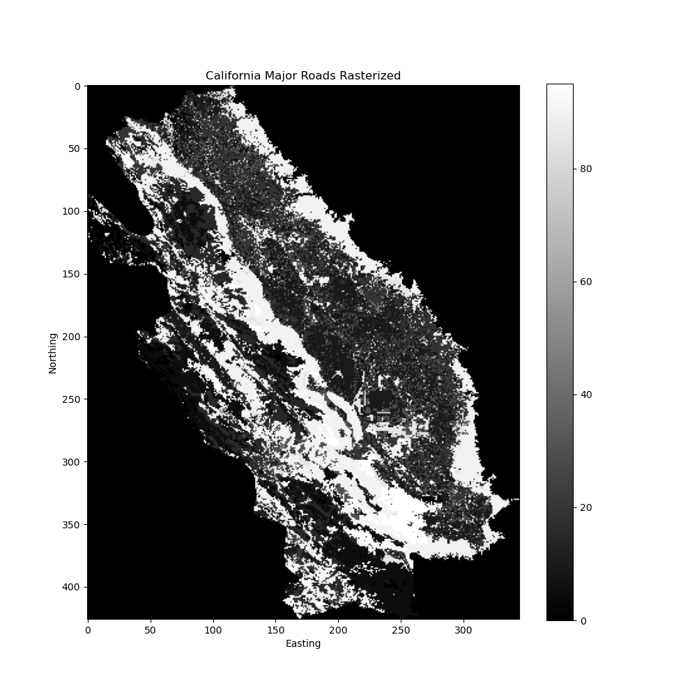

This file has instructions for how to prepare your spatial data to be run in a landscape genetics model using 'gdal'.

I already have a rasterized habitat suitability model I will be using and my goal here is to take a road shapefile layer and rasterize it so that it has the same extent and resoltuion as my habitat suitability model.

### Radish Input Files - OLD
*I have since realized this is just a veg classificatiuon layer not the fill suitabbility model. See the next section for the updated raster files*

* Habitat Suitability Model Raster Layer - KitFox-ESARPmodel-Raster1000x1000.tif

* California Major Roads Shapefile - CaliforniaMajorRoads_Reprojected.shp

Note: this wasn't memory intensive so I was able to run it on an interactive node on the hpc requesting 20GB of memory. This process CAN be memory intensive if you're working with large, fine-scale raster layers.

Install 'gdal' or create a conda environment using the provided [gdal.yml]() config file.

It is helpful to be able to plot resulting raster layers so I've provided a python script, called [plot_raster.py]() that can do so. It requires 'matplotlib' and 'rasterio' which should load automatically in your conda environment if you used the above config file. Otherwise you can install them yourself.

To execute the plotting script just use the following syntax
```
python plot_raster.py input.tif output.png
```

Determine the extent and resolution of the habitat suitability layer so you can parameterize the conversion of your roads shapefile layer.
```
gdalinfo KitFox-ESARPmodel-Raster1000x1000.tif
```
```
Driver: GTiff/GeoTIFF
Files: KitFox-ESARPmodel-Raster1000x1000.tif
Size is 345, 426
Coordinate System is:
PROJCRS["NAD83 / California Albers",
    BASEGEOGCRS["NAD83",
        DATUM["North American Datum 1983",
            ELLIPSOID["GRS 1980",6378137,298.257222101,
                LENGTHUNIT["metre",1]]],
        PRIMEM["Greenwich",0,
            ANGLEUNIT["degree",0.0174532925199433]],
        ID["EPSG",4269]],
    CONVERSION["California Albers",
        METHOD["Albers Equal Area",
            ID["EPSG",9822]],
        PARAMETER["Latitude of false origin",0,
            ANGLEUNIT["degree",0.0174532925199433],
            ID["EPSG",8821]],
        PARAMETER["Longitude of false origin",-120,
            ANGLEUNIT["degree",0.0174532925199433],
            ID["EPSG",8822]],
        PARAMETER["Latitude of 1st standard parallel",34,
            ANGLEUNIT["degree",0.0174532925199433],
            ID["EPSG",8823]],
        PARAMETER["Latitude of 2nd standard parallel",40.5,
            ANGLEUNIT["degree",0.0174532925199433],
            ID["EPSG",8824]],
        PARAMETER["Easting at false origin",0,
            LENGTHUNIT["metre",1],
            ID["EPSG",8826]],
        PARAMETER["Northing at false origin",-4000000,
            LENGTHUNIT["metre",1],
            ID["EPSG",8827]]],
    CS[Cartesian,2],
        AXIS["easting (X)",east,
            ORDER[1],
            LENGTHUNIT["metre",1]],
        AXIS["northing (Y)",north,
            ORDER[2],
            LENGTHUNIT["metre",1]],
    USAGE[
        SCOPE["State-wide spatial data management."],
        AREA["United States (USA) - California."],
        BBOX[32.53,-124.45,42.01,-114.12]],
    ID["EPSG",3310]]
Data axis to CRS axis mapping: 1,2
Origin = (-208964.104200000001583,31759.633499999999913)
Pixel Size = (1000.000000000000000,-1000.000000000000000)
Metadata:
  AREA_OR_POINT=Area
Image Structure Metadata:
  INTERLEAVE=BAND
Corner Coordinates:
Upper Left  ( -208964.104,   31759.633) (122d23'30.93"W, 38d16'42.06"N)
Lower Left  ( -208964.104, -394240.367) (122d16'29.79"W, 34d26'43.53"N)
Upper Right (  136035.896,   31759.633) (118d26'33.59"W, 38d17'31.24"N)
Lower Right (  136035.896, -394240.367) (118d31' 7.85"W, 34d27'30.39"N)
Center      (  -36464.104, -181240.367) (120d24'25.22"W, 36d23' 6.54"N)
Band 1 Block=345x5 Type=Float32, ColorInterp=Gray
  NoData Value=0
```
>You can see here the pixel size is 1000 x 1000 
>You can parameterize the spatial extent by providing the lower left ( -208964.104, -394240.367) and upper right (  136035.896,   31759.633) coordinates.

Rasterize the California Major Roads shapefile using the the same extent and resolution as the habitat suitablitity layer.
```
gdal_rasterize -burn 1 -tr 1000 1000 -te -208964.104 -394240.367 136035.896 31759.633 -a_srs EPSG:3310 -l CaliforniaMajorRoads_Reprojected CaliforniaMajorRoads_Reprojected.shp CaliforniaMajorRoads_rasterized.tif
```
Plot it to make sure it worked!
```
python plot_raster.py CaliforniaMajorRoads_rasterized.tif CaliforniaMajorRoads_rasterized.png
```
I also want a raster layer that only includes the Major Highways as opposed to all roads. To obtain this I need to subset the California Major Roads shapefile to only include roads classified as 2 which corresponds to major interstate highways. I did this using a vrt file because I ran into some issues when trying to subset the shapefile directly. A .vrt file is just an accessory file that lets you 'modify' the .shp file or add information to it without changing the file itself.In this case I set some definitions and widths in the .vrt file because they weren't being read correctly in the shapefile itself. 
  * [CaliforniaMajorRoads_Reprojected.vrt]()
```
ogr2ogr -where "road_size2 = 2" CaliforniaMajorHighways.shp CaliforniaMajorRoads_Reprojected.vrt
```
You can plot the subsetted Major Highways layer to make sure this worked correctly.
```
python plot_raster.py CaliforniaMajorHighways.tif CaliforniaMajorHighways.png
```
Rasterize the California Major Highways shapefile using the the same extent and resolution as the habitat suitablitity layer.
```
gdal_rasterize -burn 1 -tr 1000 1000 -te -208964.104 -394240.367 136035.896 31759.633 -a_srs EPSG:3310 -l CaliforniaMajorHighways CaliforniaMajorHighways.shp CaliforniaMajorHighways_rasterized.tif
```
Plot it to make sure it worked!
```
python plot_raster.py CaliforniaMajorHighways_rasterized.tif CaliforniaMajorHighways_rasterized.png
```

I realized that this raster file is actually just based on land cover types, not the full model described in Cypher et al. (2013) which incorporates ruggedness and NDVI. I now have the correct model and will regenerate my files accordingly. 

This model has the region outside of the study area classified with a value of 128 but I reclassified it as 0 which will mean "no data" in Radish. Before doing that I want to convert any existing 0 values to 1. 

There seems to be some discrepancy between how different downstream approaches (Radish vs Circuitscape-like approach) want the "no data" coded in the raster layer. Still trying to sort this out. But the code below should give input files that work for radish. Head to the next section for generating input rasters for use with gdistance (i.e. calculating least cost vs commute time)

### Radish Input Files - NEW
```
gdal_calc.py -A ESRP-kfsuit-continuous.tif --outfile=ESRP-kfsuit-continuous-temp2.tif --calc="A*(A!=0) + (A==0)*1" --NoDataValue=0

gdal_calc.py -A ESRP-kfsuit-continuous-temp2.tif --outfile=ESRP-kfsuit-continuous-modified.tif --calc="A*(A>=0)*(A<=100)" --NoDataValue=0
```
Plot it!
```
python plot_raster.py ESRP-kfsuit-continuous-modified.tif ESRP-kfsuit-continuous-modified.png
```
Now reproject the suitability layer to be in NAD1983 to match the CRS of roads .shp layer I want to convert into a raster layer so these can be modeled together in Radish.
```
gdalwarp -t_srs EPSG:3310 -dstnodata 0 ESRP-kfsuit-continuous-modified.tif ESRP-kfsuit-continuous-modified-reprojected.tif

#gdalwarp -t_srs EPSG:3310 ESRP-kfsuit-continuous.tif ESRP-kfsuit-continuous-reprojected.tif
```
Resample the raster layer at 1000m x 1000m resolution
```
gdalwarp -tr 1000 1000 -r bilinear ESRP-kfsuit-continuous-modified-reprojected.tif ESRP-kfsuit-continuous-modified-reprojected-1000x1000.tif
```
Plot it!
```
python plot_raster.py ESRP-kfsuit-continuous-modified-reprojected-1000x1000.tif ESRP-kfsuit-continuous-modified-reprojected-1000x1000.png
```

Determine the extent and resolution of the habitat suitability layer so you can parameterize the conversion of your roads shapefile layer.
```
gdalinfo ESRP-kfsuit-continuous-modified-reprojected-1000x1000.tif
```
>You can see here the pixel size is 1000 x 1000 
>You can parameterize the spatial extent by providing the lower left ( -208966.200, -394212.821) and upper right   136033.800,   31787.179) coordinates.

Rasterize the California Major Roads shapefile using the the same extent and resolution as the habitat suitablitity layer.
```
gdal_rasterize -burn 1 -tr 1000 1000 -te -208966.200 -394212.821 136033.800 31787.179 -a_srs EPSG:3310 -l CaliforniaMajorRoads_Reprojected CaliforniaMajorRoads_Reprojected.shp CaliforniaMajorRoads_rasterized_new.tif
```
Plot it to make sure it worked!
```
python plot_raster.py CaliforniaMajorRoads_rasterized_new.tif CaliforniaMajorRoads_rasterized_new.png
```
I also want to rasterize I-5 only. I have a sepaate shapefile for this major highway.
```
gdal_rasterize -burn 1 -tr 1000 1000 -te -208966.200 -394212.821 136033.800 31787.179 -a_srs EPSG:3310 -l InterstateHwy5 InterstateHwy5.shp InterstateHwy5_rasterized_new.tif
```
Plot it to make sure it worked!
```
python plot_raster.py InterstateHwy5_rasterized_new.tif InterstateHwy5_rasterized_new.png
```
Looks good!

I'm going to try to rescale my roads data to make it more in line with the habitat quitability layer. This line of code should convert any non zero cells to 100.
```
gdal_calc.py -A InterstateHwy5_rasterized_new.tif --outfile=InterstateHwy5_rasterized_rescaled_road100.tif --calc="(A==0)*1 + (A!=0)*100" --NoDataValue=0

gdal_calc.py -A InterstateHwy5_rasterized_new.tif --outfile=InterstateHwy5_rasterized_rescaled_road10.tif --calc="(A==0)*1 + (A!=0)*10" --NoDataValue=0

python plot_raster.py InterstateHwy5_rasterized_rescaled_road100.tif InterstateHwy5_rasterized_rescaled_road100.png
python plot_raster.py InterstateHwy5_rasterized_rescaled_road10.tif InterstateHwy5_rasterized_rescaled_road10.png
```
### gdistance input files

```
gdal_calc.py -A ESRP-kfsuit-continuous.tif --outfile=ESRP-kfsuit-continuous-modified-gdal.tif --calc="(A==0)*1 + (A!=0)*(A!=128)*A + (A==128)*0"
```
Now reproject the suitability layer to be in NAD1983 to match the CRS of roads .shp layer I want to convert into a raster layer so these can be modeled together in Radish.
```
gdalwarp -t_srs EPSG:3310 -dstnodata 0 ESRP-kfsuit-continuous-modified-gdal.tif ESRP-kfsuit-continuous-modified-gdal-reprojected.tif
```
Resample the raster layer at 1000m x 1000m resolution
```
gdalwarp -tr 1000 1000 -r bilinear ESRP-kfsuit-continuous-modified-gdal-reprojected.tif ESRP-kfsuit-continuous-modified-gdal-reprojected-1000x1000.tif
```
Check the extent of this new layer
```
gdalinfo ESRP-kfsuit-continuous-modified-gdal-reprojected-1000x1000.tif
```
>You can see here the pixel size is 1000 x 1000 
>You can parameterize the spatial extent by providing the lower left (-208966.200, -394212.821) and upper right (136033.800,   31787.179) coordinates.

Rasterize the California Major Roads shapefile using the the same extent and resolution as the habitat suitablitity layer.
```
gdal_rasterize -burn 1 -tr 1000 1000 -te -208966.200 -394212.821 136033.800 31787.179 -a_srs EPSG:3310 -l CaliforniaMajorRoads_Reprojected CaliforniaMajorRoads_Reprojected.shp CaliforniaMajorRoads_rasterized_new.tif
```
Plot it to make sure it worked!
```
python plot_raster.py CaliforniaMajorRoads_rasterized_new.tif CaliforniaMajorRoads_rasterized_new.png
```
I also want to rasterize I-5 only. I have a sepaate shapefile for this major highway.
```
gdal_rasterize -burn 1 -tr 1000 1000 -te -208966.200 -394212.821 136033.800 31787.179 -a_srs EPSG:3310 -l InterstateHwy5 InterstateHwy5.shp InterstateHwy5_rasterized_new.tif
```
Plot it to make sure it worked!
```
python plot_raster.py InterstateHwy5_rasterized_new.tif InterstateHwy5_rasterized_new.png
```

